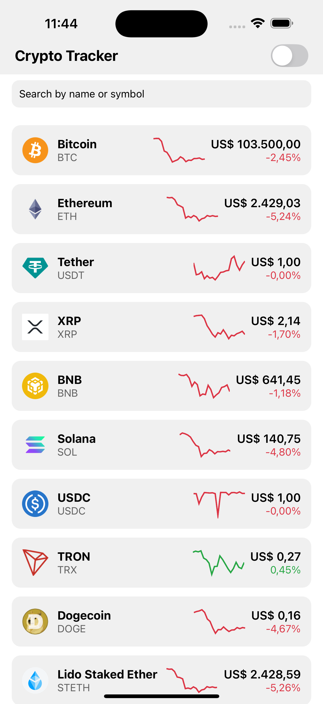
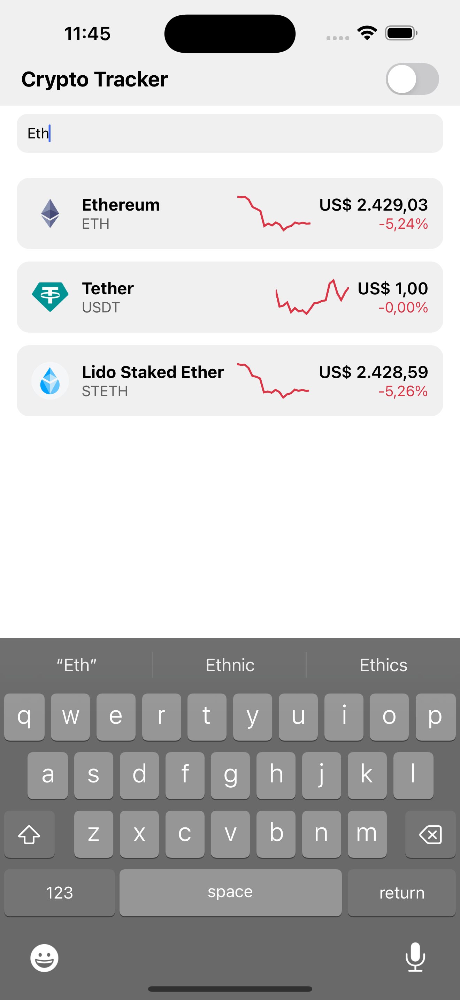
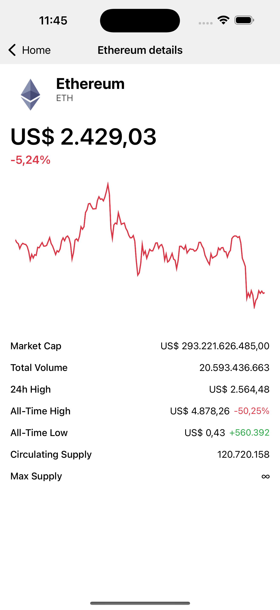
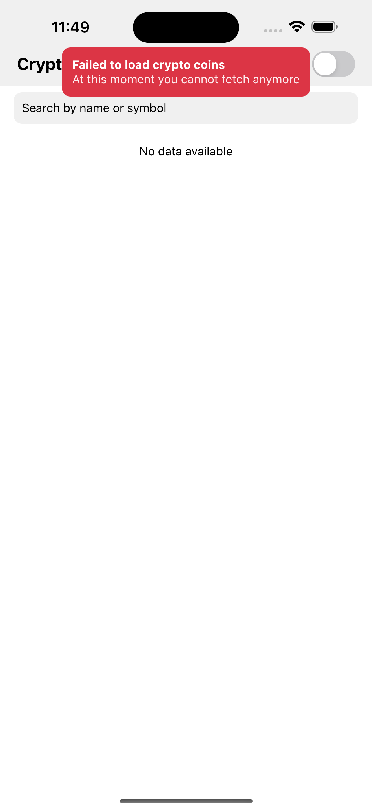
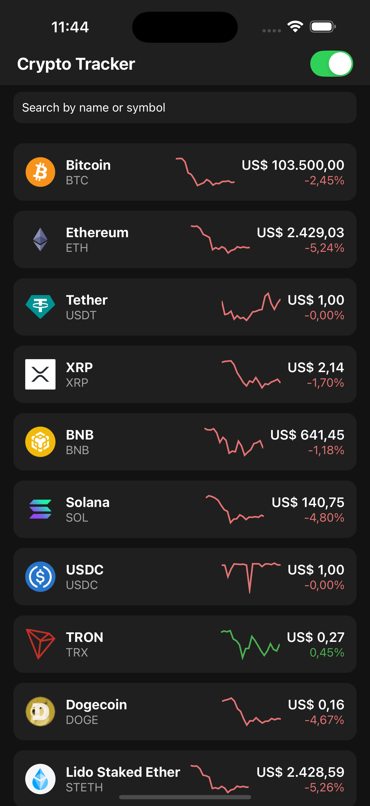
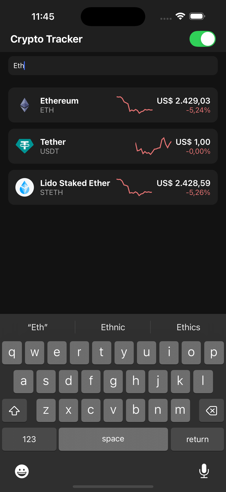
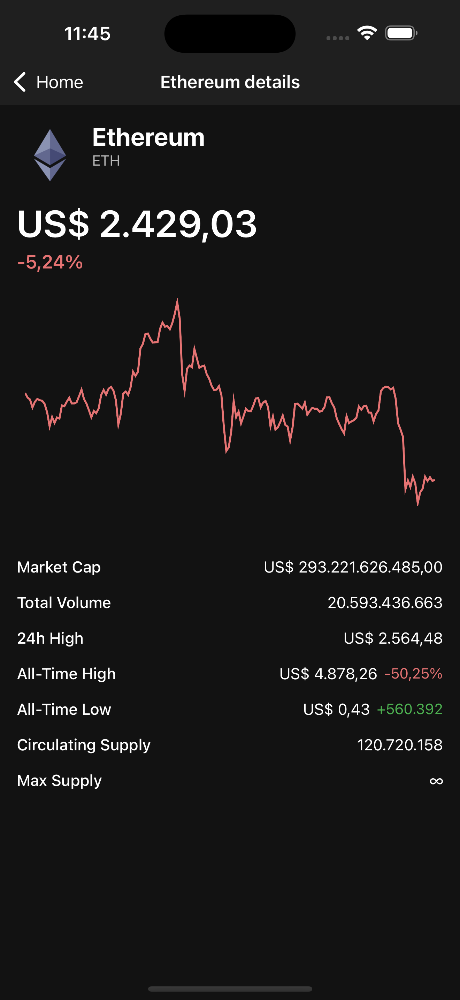
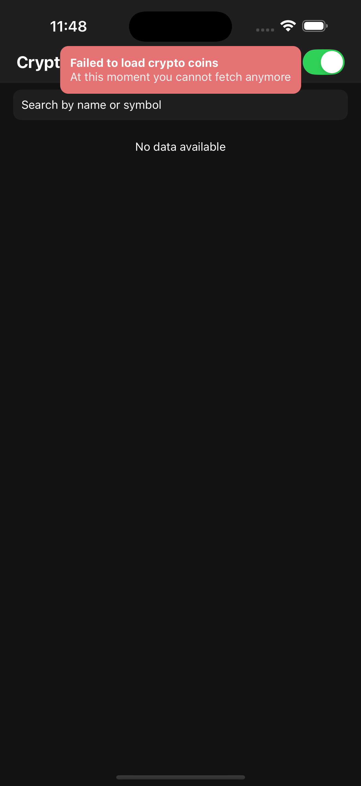

# Crypto Tracker

Crypto Tracker is a React Native application that allows users to track cryptocurrency prices, search for specific coins, and view detailed information. The app is built using modern libraries and tools to ensure a smooth and efficient user experience.

## Screenshots

### Light mode

| Status     | Home Screen                                           | Home Screen filtered                                         | Coin Details Screen                                            |
|------------|-------------------------------------------------------|--------------------------------------------------------------|----------------------------------------------------------------|
| Functional |    |  |  |
| Error      |  |                                                              |                                                                |

### Dark mode

| Status     | Home Screen                                          | Home Screen filtered                                        | Coin Details Screen                                           |
|------------|------------------------------------------------------|-------------------------------------------------------------|---------------------------------------------------------------|
| Functional |    |  |  |
| Error      |  |                                                             |                                                               |

## Features

- **Cryptocurrency List**: Displays a list of cryptocurrencies with their names and symbols.
- **Search Functionality**: Search for cryptocurrencies by name or symbol.
- **Pull-to-Refresh**: Refresh the list of cryptocurrencies.
- **Infinite Scrolling**: Load more cryptocurrencies as the user scrolls.
- **Error Handling**: Displays error messages using toast notifications.
- **Theming**: Supports light and dark themes based on the system's color scheme or user preference.

## File Structure

```javascript
── components/
│ ├── CryptoItem.tsx
│ ├── Header.tsx
│ ├── LineChart.tsx
│ ├── Metric.tsx
│ ├── Toast.tsx
├── hooks/
│ ├── useCryptoCoins.ts
│ ├── useTheme.ts
├── screens/
│ ├── CoinDetails/
│ │ ├── index.tsx
│ │ ├── styles.ts
│ ├── Home/
│ │ ├── index.tsx
│ │ ├── styles.ts
├── services/
│ ├── coingecko.ts
├── stores/
│ ├── slices/
│ │ ├── cryptoSlice.ts
│ │ ├── themeSlice.ts
├── theme/
│ ├── index.ts
├── types/
│ ├── index.ts
```

- **components/**: Contains reusable UI components like `CryptoItem`, `Header`, `LineChart`, `Metric`, and `Toast`.
- **hooks/**: Custom hooks for fetching cryptocurrency data and managing themes.
- **screens/**: Contains the main screens of the app, including `Home` and `CoinDetails`.
- **services/**: Contains API service files, such as `coingecko.ts` for fetching cryptocurrency data.
- **stores/**: Contains Redux slices for managing cryptocurrency data and theme state.
- **theme/**: Contains theme-related files for light and dark modes.
- **types/**: Contains TypeScript type definitions for the app.

## Libraries Used

### Core Libraries

- **React**: For building the user interface.
- **React Native**: For creating the mobile application.
- **Expo**: For simplifying the development process.
- **Expo-router**: For handling file-based navigation within the app.

### State Management

- **Redux**: For managing global state.
- **@reduxjs/toolkit**: For simplifying Redux setup.

### UI Components

- **react-native-toast-message**: For displaying toast notifications.
- **react-native-svg-charts**: For rendering charts.

### Utilities

- **Axios**: For making API requests.
- **react-native-reanimated**: For animations.

## APIs

The app fetches cryptocurrency data from CoinGecko using the free tier. For production use, consider using a more robust API or caching strategy to handle rate limits and ensure reliability. As this app contains free apis, not ApiKey is needed.

## Installation and Usage

### Prerequisites

- Node.js and npm or Yarn installed (Yarn by my own preference).
- Expo CLI installed globally.

### Steps

1. Clone the repository:
   ```bash
   git clone git@github.com:diego-antonelli/crypto-tracker.git
   cd crypto-tracker
   ```
2. Install dependencies:
   ```bash
   yarn install
   ```
3. Start the development server:
   ```bash
    yarn start
   ```
4. Open the app on a mobile device or emulator using the Expo Go app or running.

   ```bash
     For Android: yarn android
     For iOS: yarn ios
     For Web: yarn web
   ```

5. To execute the tests, run:
   ```bash
   yarn test
   ```
6. To execute linting, run:
   ```bash
   yarn lint
   ```
7. To run prettier, run:
   ```bash
     yarn format
   ```

### Improvements and Future Work

- Implement caching for API responses to reduce load times and API calls.
- Add more detailed coin information and historical data.
- Implement user authentication to save favorite coins.
- Add push notifications for price alerts.
- Improve error handling and user feedback mechanisms.
